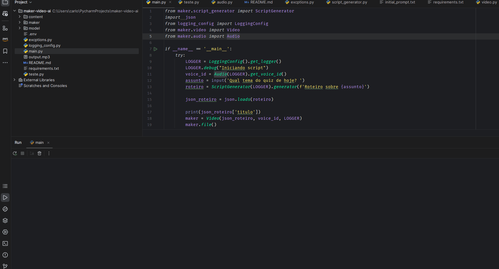

# Projeto Imersão Inteligência Artificial  Alura
Projeto de conclusão do curso de Imersão em Inteligência Artificial da Alura.

## Objetivo
O objetivo deste projeto é criar videos no formato de quiz (perguntas e respostas) automazarizados utilizando: germini (IA generativa do Google), OpenCV (biblioteca de visão computacional) e MoviePy (biblioteca para edição de videos).

## E como funciona?

1. Coleta do Tema:
   * O programa inicia perguntando ao usuário qual o tema desejado para o quiz. Essa informação é crucial para guiar a geração do roteiro.

2. Geração do Roteiro:
   * Com o tema em mãos, o programa utiliza a classe `Germini` para gerar perguntas e respostas sobre o tema
   * Um "prompt" inicial, carregado de initial_prompt.txt, instrui o modelo sobre o formato desejado para um roteiro de quiz. 
   * O tema fornecido pelo usuário é adicionado ao prompt, e o modelo Gemini gera um roteiro completo, incluindo introdução, perguntas, alternativas de resposta, respostas corretas e um encerramento. 
   * O roteiro é retornado em formato JSON, facilitando a manipulação pelo programa.

3. Síntese de Voz e Criação de Áudio:
   * O sistema utiliza a biblioteca `pyttsx3` para sintetizar a voz humana a partir do texto do roteiro.
   * O usuário escolhe a voz que será utilizada na narração do quiz.
     * As vozes disponiveis variam de acordo com o sistema operacional. 
   * O texto do roteiro (introdução, perguntas, respostas, encerramento) é processado, sintetizado  a fala para cada parte, salvando-as em arquivos MP3.

4. Criação do vídeo:
   * O programa utiliza a biblioteca `MoviePy` para criar um vídeo a partir dos arquivos de áudio gerados e de imagens de fundo.
   * As imagens de fundo são geradas a partir de templates pré-definidos, que incluem uma imagem de (selecionada aleatóriamente), o texto da pergunta e as alternativas de resposta.
   * O vídeo é renderizado e salvo em disco.

## Demonstração
Abaixo, um exemplo da execução do programa:



Video gerado:

[](https://www.youtube.com/watch?v=09425y5AVNw)

## Como executar o projeto?

### Pré-requisitos
* Python 3.8 ou superior
* Pip
* Virtualenv (desejavél)
* ffmpeg (para linux)
* git
* Credenciais do Google Cloud Platform (Google API Key)

### Instalação
1. Clone o repositório
```bash
git clone
```

2. Navegue até a pasta do projeto
```bash
cd imersao-ia-alura
```

3. Crie um ambiente virtual (recomendado) e ative-o:
```bash
python -m venv venv
source venv/bin/activate # No Windows, use `venv\Scripts\activate`
```

4. Instale as dependências do projeto
```bash
pip install -r requirements.txt
```

5. Configure as credenciais do Google Cloud Platform
   * Crie um arquivo `.env` na raiz do projeto
   * Adicione a chave da API do Google Cloud Platform ao arquivo `.env`:
   ```bash
   GOOGLE_API_KEY=<GOOGLE_API_KEY
   ```
   
6. Execute o programa
```bash
   python main.py
```   

7. Siga as instruções do programa para gerar o quiz
8. O video gerado será salvo na pasta `content/final.mp4


## Direitos Autorais

Este projeto foi desenvolvido como parte do curso de Imersão em Inteligência Artificial da Alura. O conteúdo gerado pelo modelo Gemini é de autoria do Google e está sujeito aos termos de uso da plataforma. O uso deste projeto é exclusivamente educacional e não visa lucro.

* As imagens de fundo utilizadas nos templates foram obtidas no site da Nasa (https://www.nasa.gov/multimedia/imagegallery/index.html) e estão disponíveis para uso público
* As músicas de fundo utilizadas nos vídeos foram obtidas na biblioteca de áudio do Youtube e estão disponíveis para uso público

---
* **OBS:** BOA PARTE DO README TAMBÉM FOI GERADO PELO GEMINI 😉
* **OBS2:** Algumas partes do código TAMBÉM FORAM GERADAS PELO GEMINI 😱
---

